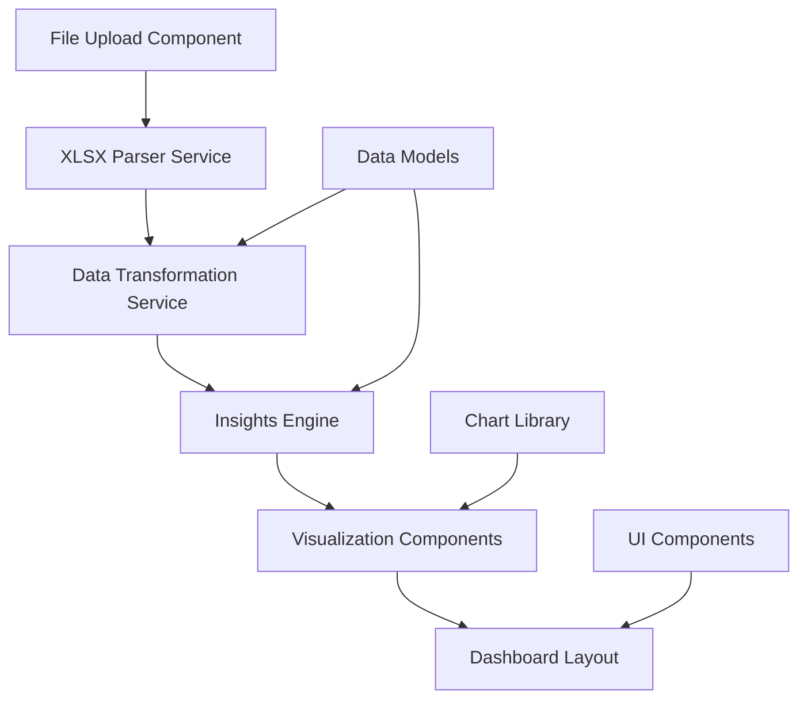

# Jira Insights Dashboard - Design Document

## Overview

The Jira Insights Dashboard is a web-based application that transforms raw Jira XLSX exports into engaging, visual insights for development teams. The system focuses on presenting data as highlights, achievements, improvement opportunities, and fun facts rather than traditional analytics dashboards.

The application follows a client-side architecture where XLSX files are processed entirely in the browser, ensuring data privacy and eliminating server-side dependencies. The design emphasizes visual storytelling, positive team engagement, and actionable insights.

## Architecture

### High-Level Architecture



### Technology Stack

- **Frontend Framework**: React with TypeScript for type safety and component-based architecture
- **XLSX Processing**: SheetJS (xlsx library) for client-side Excel file parsing
- **Data Visualization**: Chart.js or D3.js for creating engaging charts and visualizations
- **Styling**: Tailwind CSS for responsive design and consistent styling
- **State Management**: React Context API for application state
- **Build Tool**: Vite for fast development and optimized builds

### Client-Side Processing Benefits

- **Data Privacy**: All processing happens in the browser, no data leaves the user's machine
- **No Backend Required**: Simplified deployment and hosting
- **Instant Processing**: No network latency for file processing
- **Offline Capability**: Works without internet connection after initial load

## Components and Interfaces

### Core Components

#### 1. FileUploadComponent
```typescript
interface FileUploadProps {
  onFileSelected: (file: File) => void;
  isProcessing: boolean;
  error?: string;
}
```

#### 2. XLSXParserService
```typescript
interface XLSXParserService {
  parseFile(file: File): Promise<RawJiraData>;
  validateFileFormat(file: File): boolean;
}
```

#### 3. DataTransformationService
```typescript
interface DataTransformationService {
  transformRawData(rawData: RawJiraData): ProcessedJiraData;
  validateDataIntegrity(data: RawJiraData): ValidationResult;
}
```

#### 4. InsightsEngine
```typescript
interface InsightsEngine {
  generateAllInsights(data: ProcessedJiraData): DashboardInsights;
  generateEpicInsights(data: ProcessedJiraData): EpicInsights;
  generateTicketInsights(data: ProcessedJiraData): TicketInsights;
  generateBugInsights(data: ProcessedJiraData): BugInsights;
  generateAchievements(data: ProcessedJiraData): Achievement[];
  generateImprovementAreas(data: ProcessedJiraData): ImprovementArea[];
}
```

#### 5. VisualizationComponents
- **InsightCard**: Displays individual insights with engaging visuals
- **AchievementBadge**: Highlights team achievements and milestones
- **TrendChart**: Shows bug trends and other time-based data
- **StatisticHighlight**: Presents fun facts and notable statistics
- **ImprovementSuggestion**: Constructively presents areas for growth

## Data Models

### Input Data Models

```typescript
interface RawJiraTicket {
  key: string;
  summary: string;
  issueType: string;
  status: string;
  parent?: string;
  storyPoints?: number;
  created: string;
  resolved?: string;
  sprints: string[];
  originTicketType?: string;
}

interface RawJiraData {
  tickets: RawJiraTicket[];
  metadata: {
    exportDate: string;
    projectKeys: string[];
  };
}
```

### Processed Data Models

```typescript
interface ProcessedTicket {
  key: string;
  summary: string;
  issueType: string;
  status: string;
  parent?: string;
  storyPoints: number;
  createdDate: Date;
  resolvedDate?: Date;
  duration?: number; // days
  sprintCount: number;
  isEscapedBug: boolean;
  summaryLength: number;
}

interface Epic {
  key: string;
  name: string;
  ticketCount: number;
  totalStoryPoints: number;
  completedTickets: number;
}

interface ProcessedJiraData {
  tickets: ProcessedTicket[];
  epics: Epic[];
  dateRange: {
    start: Date;
    end: Date;
  };
}
```

### Insights Data Models

```typescript
interface EpicInsights {
  topByTicketCount: Epic[];
  topByStoryPoints: Epic[];
}

interface TicketInsights {
  mostSprintChanges: ProcessedTicket;
  longestDuration: ProcessedTicket;
  longestSummary: ProcessedTicket;
  shortestSummary: ProcessedTicket;
  busiestCreationDays: DayStatistic[];
  busiestClosureDays: DayStatistic[];
}

interface BugInsights {
  escapedBugStats: {
    totalCreated: number;
    totalClosed: number;
  };
  monthlyTrends: MonthlyBugTrend[];
}

interface Achievement {
  title: string;
  description: string;
  value: string;
  icon: string;
  category: 'milestone' | 'performance' | 'quality';
}

interface ImprovementArea {
  title: string;
  description: string;
  suggestion: string;
  severity: 'low' | 'medium' | 'high';
  category: 'process' | 'quality' | 'efficiency';
}
```

## Correctness Properties

*A property is a characteristic or behavior that should hold true across all valid executions of a system-essentially, a formal statement about what the system should do. Properties serve as the bridge between human-readable specifications and machine-verifiable correctness guarantees.*

Based on the requirements analysis, the following correctness properties ensure the system behaves correctly across all valid inputs:

**Property 1: File validation consistency**
*For any* file input, the system should accept the file if and only if it is a valid XLSX format
**Validates: Requirements 1.1**

**Property 2: Data parsing preservation**
*For any* valid XLSX file containing Jira data, parsing should preserve all ticket information including relationships, dates, and metadata without loss or corruption
**Validates: Requirements 1.2**

**Property 3: Error handling completeness**
*For any* invalid or malformed input file, the system should display appropriate error messages and prevent further processing
**Validates: Requirements 1.3**

**Property 4: Processing workflow consistency**
*For any* successfully parsed file, the system should always proceed to data storage and insights generation
**Validates: Requirements 1.4, 1.5**

**Property 5: Ranking accuracy**
*For any* set of epics with ticket counts or story points, the top 3 rankings should be mathematically correct with consistent tie-breaking rules
**Validates: Requirements 2.1, 2.3, 2.5**

**Property 6: Display information completeness**
*For any* generated insight or statistic, all required information fields should be present and correctly formatted in the display
**Validates: Requirements 2.2, 2.4, 3.2, 3.4, 4.2, 4.5**

**Property 7: Extreme value identification**
*For any* dataset, the system should correctly identify tickets with maximum sprint changes, longest duration, longest/shortest summaries, and busiest creation/closure days
**Validates: Requirements 3.1, 3.3, 4.1, 4.3, 4.4**

**Property 8: Duration calculation accuracy**
*For any* ticket with created and resolved dates, duration should be calculated as the exact number of days between the dates
**Validates: Requirements 3.3**

**Property 9: Incomplete data filtering**
*For any* dataset containing tickets without resolved dates, those tickets should be excluded from duration calculations while remaining in other analyses
**Validates: Requirements 3.5**

**Property 10: Bug identification accuracy**
*For any* ticket data, escaped bugs should be correctly identified using the Origin ticket type field and counted accurately for statistics
**Validates: Requirements 5.1, 5.2**

**Property 11: Cumulative calculation correctness**
*For any* monthly bug data, cumulative open bugs should equal cumulative created minus cumulative closed for each time period
**Validates: Requirements 5.4**

**Property 12: Chart completeness**
*For any* bug trend visualization, the chart should contain exactly three lines (created, closed, cumulative) with proper legends and axis labels
**Validates: Requirements 5.3, 5.5**

**Property 13: Achievement detection consistency**
*For any* completed work data, significant milestones should be identified based on objective criteria like story points delivered or epic completions
**Validates: Requirements 6.1, 6.4**

**Property 14: Pattern analysis accuracy**
*For any* ticket dataset, concerning patterns like excessive sprint changes or long durations should be correctly identified and highlighted
**Validates: Requirements 7.1, 7.3, 7.4**

**Property 15: Presentation format consistency**
*For any* generated insights, the output should be formatted as highlights and achievements rather than raw data tables
**Validates: Requirements 8.1, 8.3**

## Error Handling

### File Processing Errors
- **Invalid File Format**: Clear messaging when non-XLSX files are uploaded
- **Corrupted Files**: Graceful handling of damaged or unreadable Excel files
- **Missing Required Columns**: Validation that essential Jira fields are present
- **Data Type Mismatches**: Handling of unexpected data types in expected columns

### Data Processing Errors
- **Date Parsing Failures**: Robust handling of various date formats and invalid dates
- **Missing Parent References**: Handling of orphaned tickets with invalid epic references
- **Negative or Invalid Story Points**: Validation and sanitization of numeric fields
- **Empty Datasets**: Appropriate messaging when no valid data is found

### Runtime Errors
- **Memory Limitations**: Handling of very large XLSX files that may exceed browser memory
- **Processing Timeouts**: User feedback for long-running operations
- **Chart Rendering Failures**: Fallback displays when visualizations cannot be generated

## Testing Strategy

### Dual Testing Approach

The system requires both unit testing and property-based testing to ensure comprehensive correctness:

**Unit Testing Requirements:**
- Unit tests verify specific examples, edge cases, and error conditions
- Focus on integration points between components
- Test specific scenarios like empty datasets, single-ticket files, and boundary conditions
- Validate UI component rendering and user interactions
- Keep unit tests focused and minimal to avoid redundancy with property tests

**Property-Based Testing Requirements:**
- Use **fast-check** library for TypeScript property-based testing
- Configure each property test to run a minimum of 100 iterations
- Tag each property-based test with comments referencing the design document property
- Use format: `**Feature: jira-insights-dashboard, Property {number}: {property_text}**`
- Each correctness property must be implemented by exactly one property-based test
- Generate realistic test data that mirrors actual Jira export structures

**Test Data Generation Strategy:**
- Create generators for realistic Jira ticket data including various issue types, date ranges, and sprint histories
- Generate edge cases like tickets with no story points, missing dates, and complex epic hierarchies
- Include generators for malformed data to test error handling
- Ensure generators cover the full range of valid and invalid inputs

**Coverage Requirements:**
- All correctness properties must have corresponding property-based tests
- Critical user workflows must have unit test coverage
- Error handling paths must be tested with both approaches
- UI components must have unit tests for rendering and interaction

### Testing Framework Integration

The testing strategy integrates with the development workflow:
- Tests run automatically during development
- Property tests catch general correctness issues across many inputs
- Unit tests catch specific integration and UI issues
- Both test types provide complementary coverage for comprehensive validation

## Performance Considerations

### Client-Side Processing Optimization
- **Streaming XLSX Parsing**: Process large files in chunks to avoid memory issues
- **Web Workers**: Offload heavy computations to prevent UI blocking
- **Lazy Loading**: Load and render insights progressively
- **Caching**: Cache processed data to avoid recomputation on UI updates

### Memory Management
- **Data Cleanup**: Properly dispose of large objects after processing
- **Efficient Data Structures**: Use appropriate data structures for large datasets
- **Progressive Rendering**: Render insights incrementally to maintain responsiveness

### User Experience Optimization
- **Loading Indicators**: Clear progress feedback during file processing
- **Responsive Design**: Ensure dashboard works on various screen sizes
- **Accessibility**: Proper ARIA labels and keyboard navigation support
- **Error Recovery**: Allow users to easily retry failed operations

## Security and Privacy

### Data Protection
- **Client-Side Only**: All data processing occurs in the browser, no server transmission
- **No Data Persistence**: Data is not stored permanently unless explicitly saved by user
- **Memory Cleanup**: Sensitive data is cleared from memory after processing
- **Secure File Handling**: Validate file contents to prevent malicious uploads

### Input Validation
- **File Type Validation**: Strict XLSX format checking
- **Content Sanitization**: Clean and validate all parsed data
- **Size Limits**: Reasonable file size restrictions to prevent resource exhaustion
- **Schema Validation**: Ensure parsed data matches expected Jira export structure

## Deployment and Distribution

### Build Configuration
- **Static Site Generation**: Build as static files for easy hosting
- **Asset Optimization**: Minimize bundle size and optimize loading
- **Browser Compatibility**: Support modern browsers with appropriate polyfills
- **Progressive Web App**: Enable offline functionality and app-like experience

### Hosting Options
- **Static Hosting**: Deploy to GitHub Pages, Netlify, or similar platforms
- **CDN Distribution**: Leverage content delivery networks for global performance
- **Enterprise Deployment**: Support for internal hosting behind corporate firewalls
- **Version Management**: Clear versioning strategy for updates and rollbacks